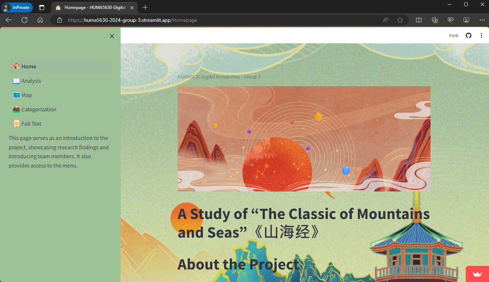
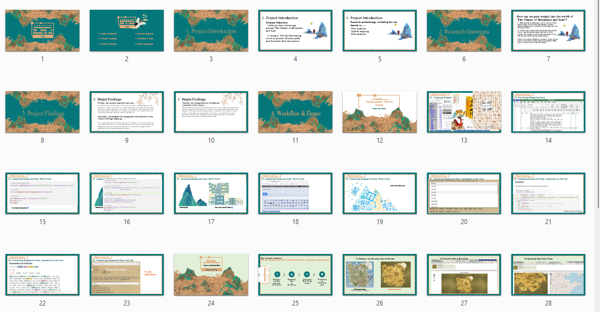

# Group Project for HUMA5630 Digital Humanities

| Student Name |   UID   |       UST email       | Github username |
| ------------ | --------| --------------------- | --------------- |
|    HAN Xuan  | 20690100| xhanap@connect.ust.hk |    [@xhanap](https://github.com/xhanap)       |
|    Wu Yutong | 20983832| ywuge@connect.ust.hk  |    [@Skylarwu2001](https://github.com/Skylarwu2001) |
|   Yuan Yuchen| 21036789| yyuanbg@connect.ust.hk| [@zhouwushigehhaorizi](https://github.com/zhouwushigehhaorizi)|
|  Shen Xiaohan| 21016820| xshenas@connect.ust.hk| [@paris19980](https://github.com/paris19980)|

# Topic
Research on the ancient Chinese mythological book "The Classic of Mountains and Seas"

# URL
https://huma5630-2024-group-3.streamlit.app/

# Presentation Slides
[PPT version](https://github.com/HUMA5630-Digital-Humanities/project-2024-group-3/blob/main/The%20Classic%20of%20Mountains%20and%20Seas.pptx) | [PDF version](https://github.com/HUMA5630-Digital-Humanities/project-2024-group-3/blob/main/The%20Classic%20of%20Mountains%20and%20Seas.pdf)

